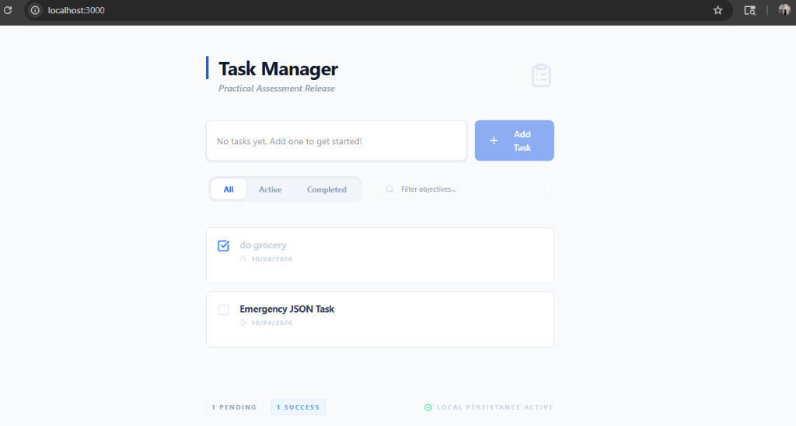
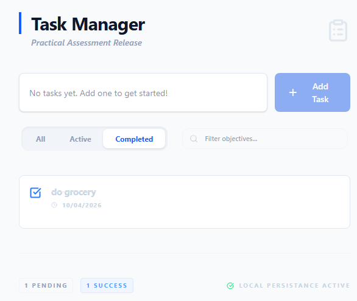
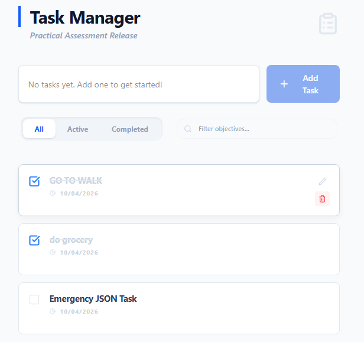

# 🚀 PrecisionTask – Full Stack Task Manager

A clean, modular, and production-ready Task Manager application built as part of a full-stack assessment.
This project focuses on **clarity, scalability, and real-world architecture practices**.


## 📸 Preview





---

## 🚀 Getting Started

### Prerequisites

* Node.js (v18+)
* npm or yarn

### Setup & Run

```bash
npm install
npm run dev
```

App runs on: http://localhost:3000

### Run Tests

```bash
npm run test:api
```

---

## 🏗️ Architecture & Code Structure

This project follows a **clean modular architecture**:

* `src/backend/` → Business logic, DB models, utilities
* `src/frontend/` → Reusable UI components
* `src/app/` → Next.js App Router, API routes, global config

✔️ Clear separation of concerns
✔️ Scalable and maintainable design

---

## ⚙️ Persistence Strategy (Hybrid Approach)

To ensure a **zero-setup experience for evaluators**:

* Primary: MongoDB
* Fallback: Local JSON (`data/tasks.json`)

👉 Automatically switches if DB is unavailable

---

## ✨ Features

* ✅ Full CRUD (Create, Read, Update, Delete tasks)
* ⚡ Optimistic UI (instant updates)
* 🔔 Toast notifications
* 🔍 Task filtering (All / Active / Completed)
* 🧠 Input validation
* 🔌 REST API integration
* 🧪 Automated API tests

---

## 📝 Key Design Decisions

* **Next.js API Routes**
  Used for performance, simplicity, and modern full-stack alignment

* **Optimistic UI**
  Prioritized user experience with real-time feedback

* **Fail-safe Persistence**
  Ensures the app runs even without database setup

---

## 🛠️ Tech Stack

* React 19
* Next.js 15 (App Router)
* TypeScript
* MongoDB
* Tailwind CSS

---

## 📌 Why This Project Stands Out

* Clean architecture (industry-level structure)
* Real-world fallback strategy (rare in student projects)
* Focus on UX + performance
* Fully testable and portable

---

## 👨‍💻 Author

**Simranjit Kaur**
---
*Built with ❤️ for a practical full-stack assessment.*
